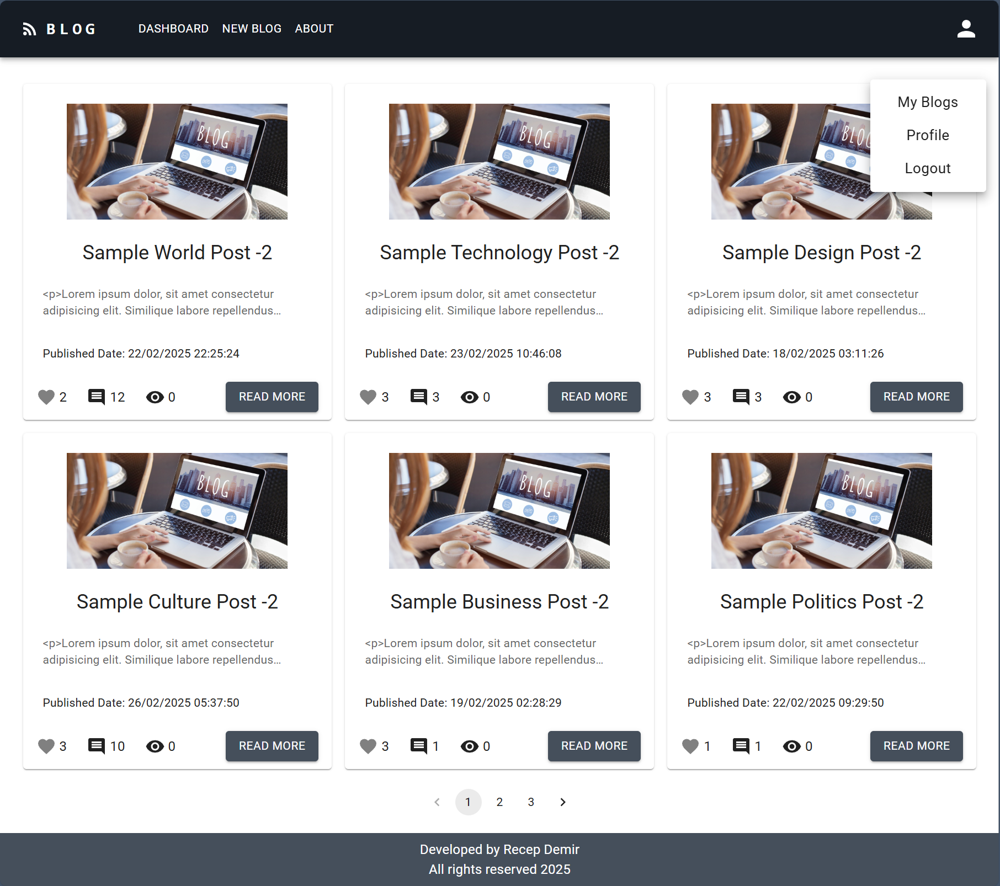

# React Milestone Blog App




This project is a user authentication application built with React.js. Users can register, log in, and log out. The project uses popular libraries such as Redux Toolkit, Material UI, and Formik for state management, UI design, and form handling.

## Technologies Used

- **React.js** (with Vite)
- **Redux Toolkit** (State Management)
- **Redux Persist** (Data Persistence)
- **React Router** (Navigation)
- **Formik & Yup** (Form Handling & Validation)
- **Material UI** (UI Design)
- **Axios** (API Requests)
- **React Toastify** (Notifications)

##  How to Run the Project

1 - Clone the Repository


git clone https://github.com/your-username/project-name.git

```bash
cd project-name
```

2- Install Dependencies
```bash
npm install
```

3️- Set Up Environment Variables
Create a .env file and add the following variable:

```bash
VITE_BASE_URL=http://your-api-url.com/
```


4️- Start the Project
```bash
npm run dev
```
-  The project will run on http://localhost:5173!
## Problem Statement

- We are adding a new project to our portfolios. So you and your colleagues have started to work on the project.

## Project Skeleton Example
```

├── src
|    ├── index.css
|    ├── index.js
|    ├── App.css
|    ├── App.js
|    ├── app
|    │   └── store.jsx
|    ├── assets
|    ├── components
|    │   ├── auth
|    │   │   ├── LoginFom.jsx
|    │   │   └── RegisterForm.jsx
|    │   ├── blog
|    │   │   ├── BlogCard.jsx
|    │   │   ├── DeleteModal.jsx
|    │   ├── FooTer.jsx
|    │   ├── NavBar.jsx
|    ├── features
|    │   ├── authSlice.jsx
|    │   └── blogSlice.jsx
|    ├── helper
|    │   └── ToastNotify.jsx
|    ├── hooks
|    │   ├── useAuthCalls.jsx
|    │   ├── useAxios.jsx
|    │   └── useBlogCalls.jsx
|    ├── pages
|    │   ├── About.jsx
|    │   ├── Dashboard.jsx
|    │   ├── Detail.jsx
|    │   ├── Login.jsx
|    │   ├── MyBlog.jsx
|    │   ├── MyBlogDetail.jsx
|    │   ├── NewBlog.jsx
|    │   ├── NotFound.jsx
|    │   ├── Profile.jsx
|    │   └── Register.jsx
|    └── router
|        ├── AppRouter.jsx
|        └── PrivateRouter.jsx

```
## Authors

- [@recep-demir](https://github.com/recep-demir)


## API Requests

### Action	 HTTP Method	Endpoint
- User     Registration	POST	/users
- User     Login	POST	/auth/login
- User     Logout	        GET	/auth/logout


